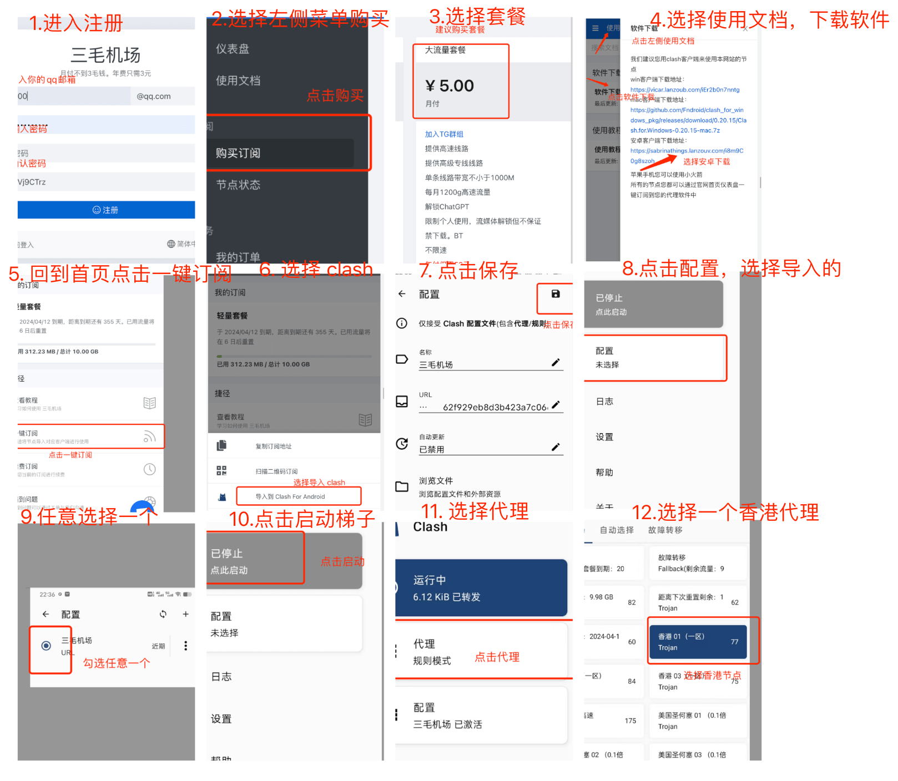
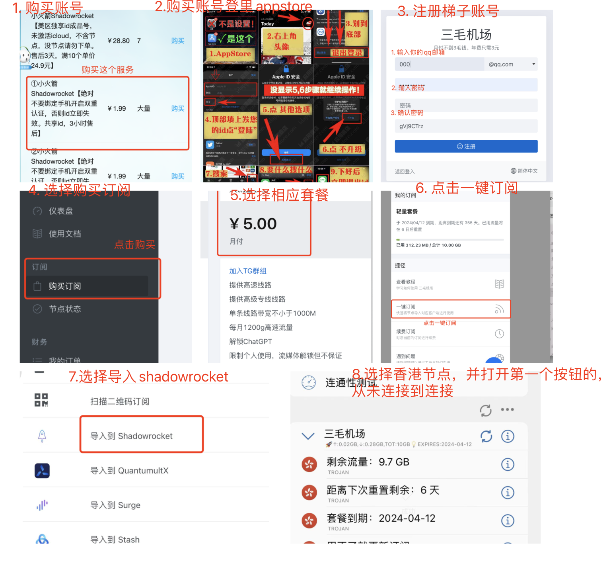

# VPN 小火箭怎么下载注册使用

9 元一年的小火箭你不容错过，一年只需要9块包你满意，视频电影随便看。注册教程如下，便宜，因此流程有点麻烦。
## 网络梯子加速器VPN小火箭
### Android（安卓），苹果下在下面，请勿看错！！！！
[首选注册地址](https://www.三毛机场.shop/#/register?code=6xuhG85m)
如果首选地址无法打开
[备用地址](https://www.三毛机场.shop/#/register?code=6xuhG85m)
看不懂的看下面的图片教程！！！！！！
1. 使用上面的首选注册地址链接去注册，里面有一个订阅服务，建议选择9块一个月的就行（如果觉得1个月10G够用，你可以选择1一年3块的服务，如果你觉得5块的也不够，可以选择8块的）；
2. 订阅完成后，在左侧菜单栏有个使用文档，点击打开，里面有软件下载（小火箭）；
3. 选择你要选择的平台，安卓选择最好一个安卓下载地址就可以了；
4. （小火箭 Clash）下载完成后，回到网页左侧菜单选择仪表盘，里面有一个一键订阅，弹出的菜单选择导入到Clash For Android，点击就会拉起你刚下载的APP，然后等待它配置完成，完成后点击右上角按钮保存；
5. 打开（小火箭 Clash），然后选择主页的配置按钮，进去后，勾选一个你刚才载入的配置，如果没有可选择的，要回到第4步；
6. 选择后回到（小火箭 Clash）首页，选择“点击启动”，就可以启动了，启动后，有一个代理的按钮，你可以进去最好选择香港节点；

看不懂的可以看图片教程

### iOS（苹果）
#### 苹果推荐方法
可以前往这里购买
[https://idappstore.cc/](https://idappstore.cc/)
打不开上面的用下面的
[https://appidshop.com/](https://appidshop.com/)
（特别申明：自己负责，不是我的服务，有问题找平台客服），里面有专门的小火箭 shadowrocket 1.99元的账户(请注意2个条件，1.99元以及叫做shadowrocket)，购买后，请按照他们官方提供的操作方法。

登录成功请下载2个软件，一个叫做 shadowrocket 一个叫做 twitter

没有用海外ID下载的软件，都是假的！！没有用海外ID下载的软件，都是假的！！没有用海外ID下载的软件，都是假的！！

[https://idappstore.cc/](https://idappstore.cc/)
打不开上面的用下面的
[https://appidshop.com/](https://appidshop.com/)
#### 接下来的步骤和安卓基本是一样的
[首选注册地址](https://bit.ly/3LhP25y)
如果首选地址无法打开
[备用地址](https://www.三毛机场.shop/#/register?code=6xuhG85m)
看不懂的看下面的图片教程！！！！
1. 使用上面的首选地址链接去注册，里面有一个订阅服务，建议选择9块一个月的就行（如果觉得1个月10G够用，你可以选择1一年3块的服务，如果你觉得5块的也不够，可以选择8块的）；
2. 确保上面的（小火箭 shadowrocket）苹果app下载完成后，回到网页左侧菜单选择仪表盘，里面有一个一键订阅，弹出菜单，选择导入 shadowrocket，点击就会拉起你刚下载的APP，然后等待它配置完成，这时候在主页就会看到很多节点选择的；
3. 打开（小火箭 shadowrocket），里面可以选择节点，可以选择一个香港节点，注意由于使用人多，晚上会卡，可以选择其他的节点，比如日本，然后打开第一个按钮，按钮原来显示“未连接”，打开那个开关就行了；
4. 这时候会在任务栏有一个vpn标识就算成功了；

看不懂的可以看图片教程

## 打开梯子测试
大家可以把梯子连接打开，如果显示数据0，可以切换节点，大家一定要记得切换节点
然后打开任意浏览器，看看是否能打开 https://www.google.com 如果打不开说明梯子配置还有问题。

